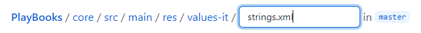

# Discussion

FAQ
---
### How do I suggest an improvement, ask a question or report an issue?
If you want to do anything from above, just create a new issue at the [Issues section](https://github.com/Goodwy/Discussion/issues) . Please be constructive and on-topic. In case you are reporting an issue either here, or at some specific app's repository, please give as much useful information as possible, ideally with steps to reproduce. Being able to reproduce a bug and understand it can really speed up the fixing.

### How can I suggest an edit to a file?
Creating pull requests with some changes is a lot simpler than most people think. Most suggestions are related to the translated strings, the steps are as follows:

1. log in to Github
2. find the file with the strings (app/src/main/res/values(-xx)/strings, for example the Italian translation of the PlayBooks is at https://github.com/Goodwy/PlayBooks/blob/master/core/src/main/res/values-it/strings.xml
3. click the pencil button at the top right corner of the file
4. edit the file with your suggestions*
5. add a commit message under the file, to the textfield which has a hint similar to "Update strings.xml". Just type in what have you done, for example "updating spanish strings".
6. click `Propose file change`
7. click the green button `Create pull request`
8. thank yourself!

\* Change only the string which is between ">" and "\</string\>", _not_ the first one after the "name=" tag, also not the strings between "\<!--" and "-->"  
\* Please escape apostrophes, meaning you have to put a backslash before every apostrophe to make it look like: \\'

For finding the proper language file at the PlayBooks go to https://github.com/Goodwy/PlayBooks/tree/master/core/src/main/res, then look for a "values-[language code]" folder. Use the `strings.xml` file inside it. If you can\'t find your language code, the file might not be translated to your language at all yet and you will have to create the whole new file.

### How do I add a new file?
You will most likely want to add a new file only if you translate an app in a new language. Doing it is actually not difficult at all, just read on.

1. log in to Github
2. find the place where the new file belongs. If it's really a translation of the strings in a new language, go to app/src/main/res, for example https://github.com/Goodwy/PlayBooks/tree/master/core/src/main/res
3. at the top right corner click at `Create new file`
4. after the `res` folder you can type in your folder path. For creating a German translation just type in `values-de/` (where `de` is the country code). The new folder will be added automatically after typing the slash.
5. add a file name, i.e. `strings.xml` (the path should look similar to the image below)
6. copy the contents of an already existing strings.xml file into the new file (for example the content of https://github.com/Goodwy/PlayBooks/blob/master/core/src/main/res/values/strings.xml)
7. add your string translations*
8. add a commit message under the file, to the textfield which has a "Create new file" hint. Just type in what have you done, for example "adding spanish strings".
9. press `Propose new file`
10. click the green button `Create pull request`
11. thank yourself!

\* Change only the string which is between ">" and "\</string\>", _not_ the first one after the "name=" tag.  
\* Please escape apostrophes, meaning you have to put a backslash before every apostrophe to make it look like: \\'
